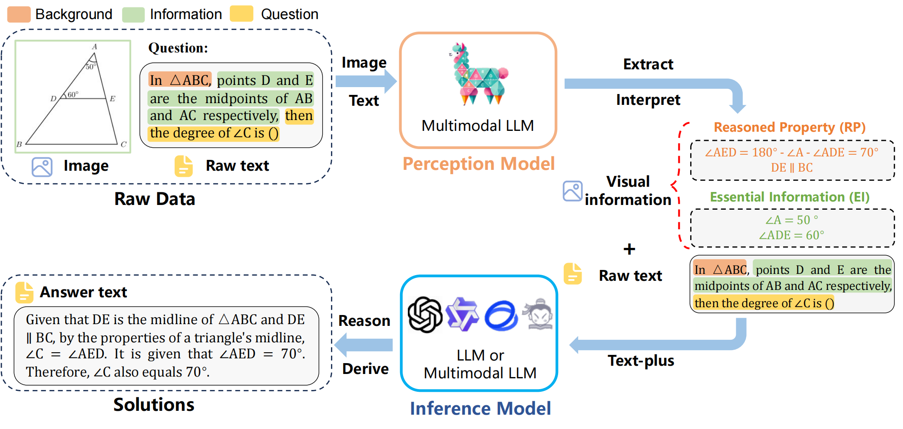
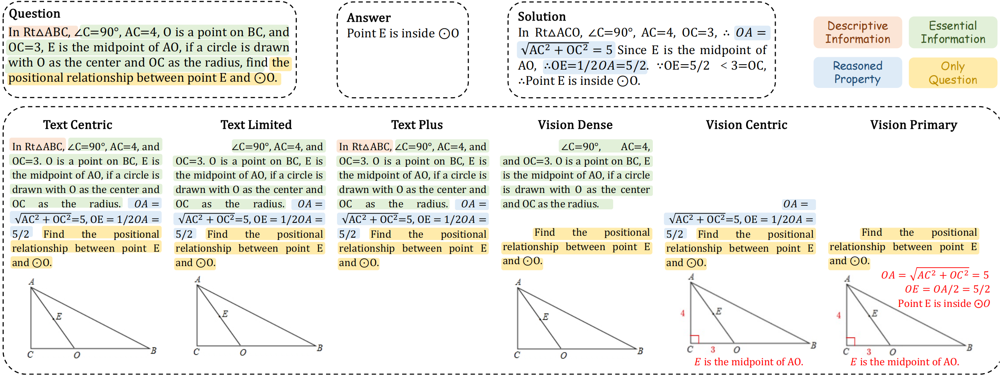

#  MathFlow: Enhancing the Perceptual Flow of MLLMs for Visual Mathematical Problems

 
 
 


<!-- 🌟 For more details, please refer to the project page with dataset exploration and visualization tools: [https://mathverse-cuhk.github.io/](https://mathverse-cuhk.github.io/). -->

## 💥 News
- **[2025.03.13]** 🚀 We release the [arXiv paper] (https://arxiv.org/abs/2503.16549), the ***testmini*** set of FlowVerse at [[🤗 Huggingface Dataset]](https://huggingface.co/datasets/MathFlow-ZJU/MathFlow/tree/main)!


## 👀 About MathFlow

Despite impressive performance across diverse tasks, Multimodal Large Language Models (MLLMs) have yet to fully demonstrate their potential in visual mathematical problem-solving, particularly in accurately perceiving and interpreting diagrams.
<p align="center">
     <br>
    The Overview of MathFlow Pipeline.
</p>

Inspired by typical processes of humans, we hypothesize that the perception capabilities to extract meaningful information from diagrams is crucial, as it directly impacts subsequent inference processes. 
To validate this hypothesis, we developed FlowVerse, a comprehensive benchmark that categorizes all information used during problem-solving into four components, which are then combined into six problem versions for evaluation.
<p align="center">
     <br>
        Six Versions of Problems in FlowVerse. 
</p>
Our preliminary results on FlowVerse reveal that existing MLLMs exhibit substantial limitations when extracting essential information and reasoned property from diagrams and performing complex reasoning based on these visual inputs. In response, we introduce MathFlow, a modular problem-solving pipeline that decouples perception and inference into distinct stages, thereby optimizing each independently. Given the perceptual limitations observed in current MLLMs, we trained MathFlow-P-7B as a dedicated perception model.
Experimental results indicate that MathFlow-P-7B yields substantial performance gains when integrated with various closed-source and open-source inference models. This demonstrates the effectiveness of the MathFlow pipeline and its compatibility to diverse inference frameworks.
The FlowVerse benchmark, code and models will be made publicly available upon publication.


## 💪 Evaluation by yourself

We provide the code to derive the **'Acc' scores and 'CoT-E' scores** by yourself, which requires advanced LLMs (e.g., [ChatGPT/GPT-4](https://platform.openai.com/account/api-keys), or [Qwen-Max](https://help.aliyun.com/zh/dashscope/developer-reference/api-details)) to extract and match answers. 

There are two steps for the evaluation of 'Acc' scores and 'CoT-E' scores, where we prompt the ChatGPT/GPT-4 API as an example to obtain the 'Acc' scores:
#### Step1: Answer Obtain
```bash
pip install openai
cd evaluation_cot 
# Please replace the GPT_API with your own API key in models/gpt.py
python generate_response.py \
--data_dir PATH_TO_DATA_DIR \
--input_file PATH_TO_INPUT_FILE \
--output_dir PATH_TO_OUTPUT_DIR \
--output_file PATH_TO_OUTPUT_FILE \
--mode MODE_OF_FLOWVERSE \
--img_dir PATH_TO_IMG_DIR \
```

#### Step2: Answer Extraction
```bash
python extract_answer_s1.py \
--model_output_file PATH_TO_OUTPUT_FILE \
--output_file PATH_TO_GENERATED_FILE \
--mode MODE_OF_FLOWVERSE \
--save_file PATH_TO_ENTRACTION_FILE \
```

Note that, step 1 is ***optional*** if your MLLM can directly output a clean answer for scoring.

#### Step3: Answer Scoring

```bash
python score_answer_s2.py \
--save_file PATH_TO_SCORE_FILE \
--mode MODE_OF_FLOWVERSE \
--output_dir PATH_TO_OUTPUT_DIR \
--output_file PATH_TO_SCORE_FILE \
--trunk_response 30 \
--save_every 10 \
```
#### Step4: Answer Statistics

```bash
python score_final.py \
--data_dir PATH_TO_DATA_DIR \
--input_file PATH_TO_INPUT_FILE \
--save_file PATH_TO_SCORE_FILE \
--mode MODE_OF_FLOWVERSE 
```


## 💪 Training Code 

Coming soon!

<!-- ## 🏆 Leaderboard -->

<!-- ### Contributing to the *testmini* Leaderboard -->

<!-- 🚨 The [Leaderboard](https://mathverse-cuhk.github.io/#leaderboard) for the *testmini* set is continuously being updated, welcoming the contribution of your excellent MLLMs! ***Currently, we regard the 'w/o' scores without the CoT evaluation as the primary metric in MathVerse***, which is more cost-effective and saves time. -->
## 🤖 Data Usage

[FlowVerse](https://huggingface.co/datasets/MathFlow-ZJU/MathFlow/tree/main) dataset is available on Huggingface.


## 📈 Evaluation Results

Coming soon!

## 📝 Citation

If you find our data or code useful in your research, please use the following BibTeX entry.
```BibTeX
@article{chen2025mathflow,
  title={MathFlow: Enhancing the Perceptual Flow of MLLMs for Visual Mathematical Problems},
  author={Chen, Felix and Yuan, Hangjie and Xu, Yungiu and Feng, Tao and Cen, Jun and Liu, Pengweiand Huang, Zeying and Yang, Yi.},
  journal={arXiv preprint arXiv:2503.16549},
  year={2025}
}
```

## 🧠 Related Work

Explore our additional research on **Vision-Language Large Models**, focusing on multi-modal LLMs and mathematical reasoning:

- **[MathVista]** [MathVista: Evaluating Mathematical Reasoning of Foundation Models in Visual Contexts](https://github.com/lupantech/MathVista)
- **[InternVL]** [InternVL: A Unified Multimodal Foundation Model for Visual Learning](https://github.com/OpenGVLab/InternVL)
- **[InternVL2]** [InternVL2_._5: InternVL2.5: Expanding Performance Boundaries of Open-Source Multimodal Models with Model, Data, and Test-Time Scaling](https://github.com/OpenGVLab/InternVL)
- **[MathVerse]** [MathVerse: Does Your Multi-modal LLM Truly See the Diagrams in Visual Math Problems?](https://github.com/ZrrSkywalker/MathVerse)
- **[Qwen2VL]** [Qwen2VL: A Multimodal Large Language Model with Enhanced Visual Understanding](https://github.com/QwenLM/Qwen2VL)
- **[Gemini]** [Gemini](https://github.com/google/gemini)
- **[GPT-4]** [GPT-4](https://github.com/openai/gpt-4)
- **[Claude]** [Claude](https://github.com/anthropic-ai/claude)
- **[DeepSeekV3]** [DeepSeek V3](https://github.com/deepseek-ai/deepseek-v3)
- **[DeepSeekR1]** [DeepSeek R1](https://github.com/deepseek-ai/deepseek-r1)
